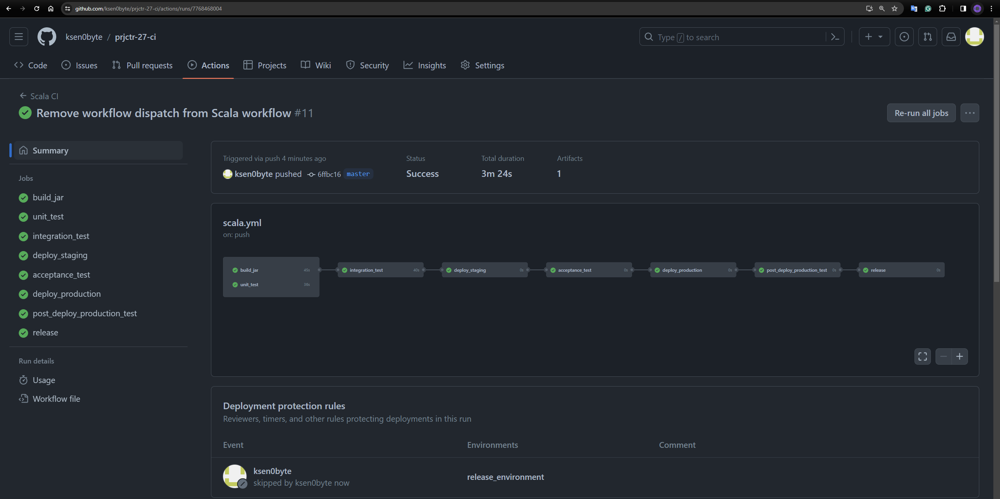
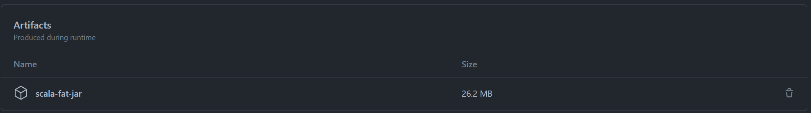
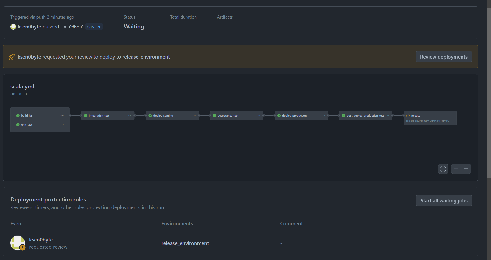

# Project Name: Scala CI/CD Pipeline

This project demonstrates a comprehensive CI/CD pipeline using GitHub Actions for a Scala application. The pipeline
encompasses everything from building a fat JAR, running unit and integration tests, deploying to staging, conducting
acceptance tests, deploying to production, and performing post-deployment tests.

## CI/CD Pipeline Overview

The CI/CD pipeline is designed to ensure that every push to the `master` branch triggers a series of jobs that automate
the testing, building, and deployment phases of the development cycle. Below is a breakdown of each stage in the
pipeline:

1. **Build JAR**: Compiles the Scala code and packages it into a fat JAR, including all dependencies.
2. **Unit Tests**: Runs unit tests to ensure code integrity and functionality.
3. **Integration Tests**: Conducts integration tests to verify the application components work together as expected.
4. **Deploy to Staging**: Deploys the application to a staging environment for further testing.
5. **Acceptance Tests**: Performs acceptance testing in the staging environment.
6. **Deploy to Production**: Deploys the application to the production environment.
7. **Post-Deployment Production Test**: Executes tests in the production environment to confirm the deployment's
   success.
8. **Release**: A manual step that allows for a final review before the release is finalized.

## GitHub Actions Workflow

The [`.github/workflows/scala.yml`](.github/workflows/scala.yml) file defines the pipeline. It's triggered on every push
to the `master` branch,
ensuring that changes are automatically built, tested, and ready for deployment.

### Key Features

- **Scala and Java Setup**: Uses `olafurpg/setup-scala` action to prepare the environment for Scala and Java
  development.
- **Artifact Handling**: Artifacts from the build process are uploaded for use in later stages or for archival purposes.
- **Manual Release Step**: Includes a manual intervention point before the final release, allowing for last-minute
  reviews.

## Screenshots

Below are screenshots illustrating key points in the CI/CD pipeline:

### Pipeline Overview

A comprehensive view of the pipeline in action, illustrating the flow from build to release.

### Job Artifacts

This screenshot shows the artifacts generated by the build process, available for download or use in subsequent pipeline
steps.

### Manual Release Job

Here, the manual release step is depicted, showcasing how stakeholders can trigger the final release to production after
all automated tests and checks have passed.
